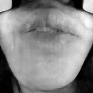

# Photo-Realistic-Super-Resoluton
Torch Implementation of "Photo-Realistic Single Image Super-Resolution Using a Generative Adversarial Network"
[[Paper]](https://arxiv.org/pdf/1609.04802)

This is a prototype implementation developed by [Harry Yang](https://scholar.google.com/citations?user=jpIFgToAAAAJ&hl=en&authuser=3). 

 

## Getting started

####Training
prepare your images under a sub-folder of a root folder and run:
``` bash
train_folder=your_root_folder model_folder=your_save_folder th run_sr.lua 
```

By default it resizes the images to 96x96 as ground truth and 24x24 as input, but you can specify the size using `loadSize`. Note current generator network only supports 4x super-resolution.

####Loading a saved model to train
run:
```
D_path=your_saved_D_model G_path=your_saved_G_model train_folder=your_root_folder model_folder=your_save_folder th run_resume.lua
```

####Testing
prepare your test images under a sub-folder of a root folder and run:
```
test_folder=your_root_folder model_file=your_G_model result_path=location_to_save_results th run_test.lua
```

## Report Issues
[Contact](mailto:harryyang.hk@gmail.com)

##Todo:

1. Add TV loss.
2. Provide trained models.
