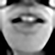

# Photo-Realistic-Super-Resoluton
Torch Implementation of "Photo-Realistic Single Image Super-Resolution Using a Generative Adversarial Network"
[[Paper]](https://arxiv.org/pdf/1609.04802)

This is a prototype implementation developed by [Harry Yang](http://www.harryyang.org). 

 

## Getting started

####Training
prepare your images under a sub-folder of a root folder
``` bash
t_folder=your_root_folder model_folder=your_save_folder/ th run_sr.lua 
```

By default it resizes the images to 96x96 as ground truth and 24x24 as input, but you can specify the size using `loadSize`. Note current generator network only supports 4x super-resolution. In addition, the input size must be dividable by 32 (such as 96, 128, 160, etc.).

By default it resizes the images to 96x96 as ground truth and 24x24 as input, but you can specify the size using `loadSize` and `scale`.


####Loading a saved model to train
```
D_path=your_saved_D_model G_path=your_saved_G_model t_folder=your_root_folder model_folder=your_save_folder/ th run_resume.lua
```

####Testing
prepare your test images under a sub-folder of a root folder
```
t_folder=your_root_folder model_file=your_G_model result_path=location_to_save_results th run_test.lua
```

## Report Issues
[Contact](mailto:harryyang.hk@gmail.com)

## Citation

If you find this code useful for your research, please cite:

```
@misc{Johnson2015,
  author = {Yang, Harry},
  title = {super-resolution using GAN},
  year = {2016},
  publisher = {GitHub},
  journal = {GitHub repository},
  howpublished = {\url{https://github.com/leehomyc/Photo-Realistic-Super-Resoluton}},
}
```

```
